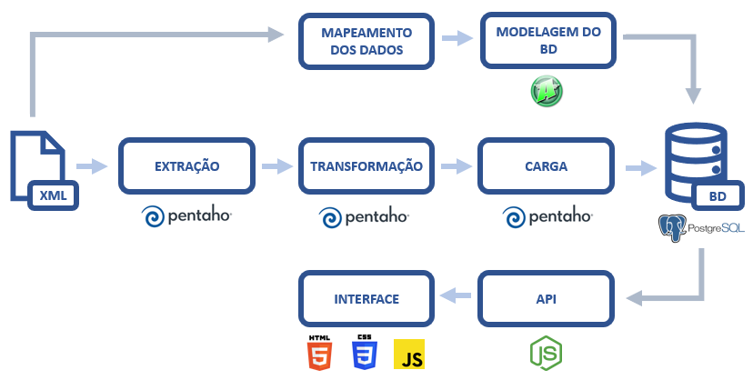

# TCC | BI Master | PUC-Rio

## [EM DESENVOLVIMENTO] Processo de BI para acompanhamento de registros de marcas no INPI

Christian Testtzlaffe Alpoim ([Linkedin](https://www.linkedin.com/in/christian-testtzlaffe-alpoim/))

**Orientador:** Prof. Anderson Nascimento

<hr>

### Objetivo

Este trabalho tem o objetivo de construir um processo de Business Intelligence (BI) com fluxo de coleta, transformação e carga/persistência de dados dos processos de registros de marcas originados pelo Instituto Nacional de Propriedade Industrial (INPI). Antes deste processo de extração, transformação e carga (ETL), é necessário o mapeamento dos dados, a modelagem e a criação do repositório destes registros (banco de dados relacional). Uma vez que o processo esteja configurado e sendo executado periodicamente, este banco de dados permitirá a construção de aplicações para acompanhamento e alerta sobre o avanço nos registros de marcas.

<hr>

### INPI

O Instituto Nacional da Propriedade Industrial (INPI) é uma autarquia federal brasileira, criada em 1970, vinculada ao Ministério do Desenvolvimento, Indústria e Comércio Exterior (MDIC).

Conforme art. 2º da Lei nº 5.648/1970, "O INPI tem por finalidade principal executar, no âmbito nacional, as normas que regulam a propriedade industrial, tendo em vista a sua função social, econômica, jurídica e técnica, bem como pronunciar-se quanto à conveniência de assinatura, ratificação e denúncia de convenções, tratados, convênios e acordos sobre propriedade industrial". (Redação dada pela Lei nº 9.279, de 1996).

Entre suas funções, o INPI é responsável pelo registro e concessão de marcas, que é a base para este trabalho.

<hr>

### Etapas, Arquitetura e Tecnologias

O diagrama abaixo resume as etapas do processo, bem como a arquitetura da solução e indicação das tecnologias:



- Fonte dos dados: arquivos XML do site do INPI
- Mapeamento dos dados: estudo das principais tags e atributos do arquivo, bem como suas relações
- Modelagem dos dados: desenhar o modelo de tabelas e seus relacionamentos, com uso do [SQL Power Architect](http://www.bestofbi.com/page/architect)
- BD (banco de dados): criação e atualização das tabelas por meio do [PostgreSQL](https://www.postgresql.org/)
- ETL: extrações, transformações e cargas com [Pentaho Data Integration (PDI)](https://help.pentaho.com/Documentation/7.1/0D0/Pentaho_Data_Integration)
- API (Application Programming Interface): construção do backend da solução com [Node.js](https://nodejs.org/en/)
- Interface: solução web com utilização das tecnologias HTML, CSS e JavaScript

<hr>

### Fonte dos dados
Os dados a serem coletados para o processo de BI são públicos e disponibilizados na <a href="http://revistas.inpi.gov.br/rpi" target="_blank">Revista da Propriedade Industrial</a>. O INPI divulga semanalmente, toda terça-feira, os dados de atualização sobre os processos de registros de marcas, tanto no formato pdf quanto em XML. Neste trabalho, foi avaliado que o arquivo XML contém as principais informações de despachos do INPI, e servirá como origem dos dados para o processo de ETL.

Vale destacar que o arquivo XML tem dezenas de milhares de despachos, cada um em torno de 20 a 30 MB.

<hr>

### Mapeamento dos dados

O PDI também auxiliou na listagem de todas as tags e nós do arquivo XML (no exemplo, revista nº 2625). Por meio da etapa "Get data from XML" na ferramenta, na funcionalidade "Get XPath nodes", é possível visualizar todos os nós (tags) presentes no arquivo:

Imagem do resultado do "Get XPath nodes":


Além das tags, alguns nós do XML têm atributos, por exemplo: na tag "titular", há atributos como nome, país e UF do titular da marca.

Tabela com árvore de tags e atributos:

<table>
<tr><th>TAG</th><th>CAMINHO</th><th>ATRIBUTOS</th><th>CONTÉM TEXTO INTERNO?</th></tr>
<tr><td>revista</td><td>/revista</td><td>numero, data</td><td></td></tr>
<tr><td>processo</td><td>/revista/processo</td><td>numero, data-deposito, data-concessao, data-vigencia</td><td></td></tr>
<tr><td>despachos</td><td>/revista/processo/despachos</td><td></td><td></td></tr>
<tr><td>despacho</td><td>/revista/processo/despachos/despacho</td><td>codigo, nome</td><td></td></tr>
<tr><td>texto-complementar</td><td>/revista/processo/despachos/despacho/texto-complementar</td><td></td><td>Sim</td></tr>
<tr><td>texto-sobrestamento</td><td>/revista/processo/despachos/despacho/texto-sobrestamento</td><td></td><td>Sim</td></tr>
<tr><td>protocolo</td><td>/revista/processo/despachos/despacho/protocolo</td><td>numero, data, codigoServico</td><td></td></tr>
<tr><td>requerente</td><td>/revista/processo/despachos/despacho/protocolo/requerente</td><td>nome-razao-social, pais, uf</td><td></td></tr>
<tr><td>procurador</td><td>/revista/processo/despachos/despacho/protocolo/procurador</td><td></td><td>Sim</td></tr>
<tr><td>cedentes</td><td>/revista/processo/despachos/despacho/protocolo/cedentes</td><td></td><td></td></tr>
<tr><td>cedente</td><td>/revista/processo/despachos/despacho/protocolo/cedentes/cedente</td><td>nome-razao-social, pais, uf</td><td></td></tr>
<tr><td>cessionarios</td><td>/revista/processo/despachos/despacho/protocolo/cessionarios</td><td></td><td></td></tr>
<tr><td>cessionario</td><td>/revista/processo/despachos/despacho/protocolo/cessionarios/cessionario</td><td>nome-razao-social</td><td></td></tr>
<tr><td>marca</td><td>/revista/processo/marca</td><td>apresentacao, natureza</td><td></td></tr>
<tr><td>nome</td><td>/revista/processo/marca/nome</td><td></td><td>Sim</td></tr>
<tr><td>titulares</td><td>/revista/processo/titulares</td><td></td><td></td></tr>
<tr><td>titular</td><td>/revista/processo/titulares/titular</td><td>nome-razao-social, pais, uf</td><td></td></tr>
<tr><td>procurador</td><td>/revista/processo/procurador</td><td></td><td>Sim</td></tr>
<tr><td>sobrestadores</td><td>/revista/processo/sobrestadores</td><td></td><td></td></tr>
<tr><td>sobrestador</td><td>/revista/processo/sobrestadores/sobrestador</td><td>processo, marca</td><td></td></tr>
<tr><td>lista-classe-nice</td><td>/revista/processo/lista-classe-nice</td><td></td><td></td></tr>
<tr><td>classe-nice</td><td>/revista/processo/lista-classe-nice/classe-nice</td><td>codigo</td><td></td></tr>
<tr><td>especificacao</td><td>/revista/processo/lista-classe-nice/classe-nice/especificacao</td><td></td><td>Sim</td></tr>
<tr><td>traducao-especificacao</td><td>/revista/processo/lista-classe-nice/classe-nice/traducao-especificacao</td><td></td><td>Sim</td></tr>
<tr><td>status</td><td>/revista/processo/lista-classe-nice/classe-nice/status</td><td></td><td>Sim</td></tr>
<tr><td>classes-vienna</td><td>/revista/processo/classes-vienna</td><td></td><td></td></tr>
<tr><td>classe-vienna</td><td>/revista/processo/classes-vienna/classe-viena</td><td>codigo, edicao</td><td></td></tr>
<tr><td>classe-nacional</td><td>/revista/processo/classe-nacional</td><td>codigo</td><td></td></tr>
<tr><td>especificacao</td><td>/revista/processo/classe-nacional/especificacao</td><td></td><td>Sim</td></tr>
<tr><td>sub-classes-nacional</td><td>/revista/processo/classe-nacional/sub-classes-nacional</td><td></td><td></td></tr>
<tr><td>sub-classe-nacional</td><td>/revista/processo/classe-nacional/sub-classes-nacional/sub-classe-nacional</td><td>codigo</td><td></td></tr>
<tr><td>dados-de-madri</td><td>/revista/processo/dados-de-madri</td><td>numero-inscricao-internacional, data-recebimento-inpi</td><td></td></tr>
<tr><td>apostila</td><td>/revista/processo/apostila</td><td></td><td>Sim</td></tr>
<tr><td>prioridade-unionista</td><td>/revista/processo/prioridade-unionista</td><td></td><td></td></tr>
<tr><td>prioridade</td><td>/revista/processo/prioridade-unionista/prioridade</td><td>data, numero, pais</td><td></td></tr>
</table>

<br>

As tags mais importantes para este trabalho são:

Revista: cada semana, o INPI disponibiliza uma revista, e esta tag do XML indica o número e a data da divulgação.

Processo: primeira tag após o nó da revista. Há dezenas de milhares de processos por revista/semana. Tem como atributos o número do processo, e em algumas situações, traz a data de depósito, a data de concessão e a data de vigência de uso da marca.

Marca: em alguns tipos de registros, esta tag aparece indicando o nome da marca, a natureza e a apresentação (nominativa, figurativa ou mista).

Despachos: junto com o processo, os depachos são as principais informações do arquivo. No despacho é que está a descrição do que aconteceu no processo naquela semana (com código de despacho), e em alguns casos traz observações (texto-complementar ou texto-sobrestamento).

Titulares: lista os nomes, estados e países dos titulares da marca.

Classes Vienna e Nice: são classificações de atividades que a marca está atrelada. 

Abaixo, um exemplo de processo no arquivo XML:

```xml
<processo numero="920493416" data-deposito="19/08/2020">
    <despachos>
      <despacho codigo="IPAS421" nome="Republicação de pedido">
        <texto-complementar>Republicado o pedido, tendo em vista alteração da classe internacional reivindicada para fins de adequação da mesma à especificação apresentada.</texto-complementar>
      </despacho>
    </despachos>
    <titulares>
      <titular nome-razao-social="PABLO SILVA NEVES" pais="BR" uf="MG"/>
    </titulares>
    <marca apresentacao="Mista" natureza="Produtos e/ou Serviço">
      <nome>ESTUDIO CAR DETALHAMENTO</nome>
    </marca>
    <classes-vienna>
      <classe-vienna codigo="18.1.9" edicao="4"/>
    </classes-vienna>
    <lista-classe-nice>
      <classe-nice codigo="37">
        <especificacao>Lavagem de Veículos, Limpeza de Veículos e Polimento de Veículos. Lavador e Polidor&#xd;
de carro independente, serviço de Lavagem, lubrificação e polimento de veículos&#xd;
automotores. Detalhamento em veículos automotroes.; </especificacao>
        <status>Pendente (com especificação livre)</status>
      </classe-nice>
    </lista-classe-nice>
  </processo>

```
<hr>

### Modelagem das tabelas e campos

A desenvolver

<hr>

### Criação do banco de dados

A desenvolver

<hr>

### Extração, transformação e carga dos dados
O processo central do trabalho, o ETL, segue algumas etapas importantes para o alcance do objetivo de geração do banco de dados devidamente carregado. Abaixo, um diagrama sobre este fluxo:

[INSERIR DIAGRAMA]

Fonte dos dados (XML semanal de marcas da Revista de Propriedade Industrial) → Coleta dos dados → Transformações dos dados (conteúdos das tags do XML para formato tabular) → carga (inserção de registros no banco de dados).

<hr>

### Transformação com PDI

A desenvolver

<hr>

### Carga dos dados

A desenvolver

<hr>

### Construção da API

A desenvolver

<hr>

### Construção da interface web

A desenvolver

<hr>

### Resultados e conclusões

A desenvolver


